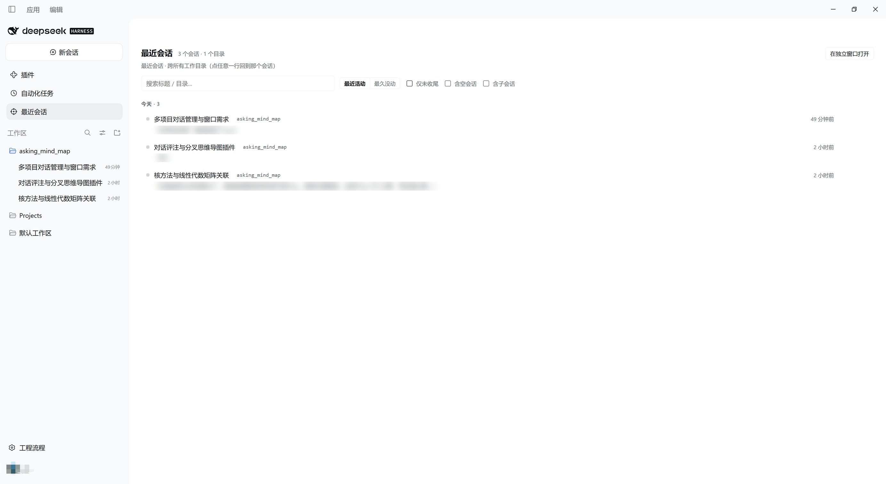

# dsh-recent-sessions（最近会话）

**把你在所有工作目录里用过的会话，拉平成一块跨目录的列表——外加一个"先记下来，回头它会自己回来找你"的地方。**

这是 [DSH（DeepSeek Harness）](https://harness.deepseek.com) 的客户端插件。English: [README.en.md](README.en.md)



---

## 为什么做它

DSH 的侧栏**按工作目录分组**会话：每个目录只显示最近几条、只列你注册过的目录。可当你同时在十几个文件夹里干活时，**一阵子没碰的项目就是不在屏幕上**；而一个"住在你没想到的那个目录里"的会话，等于丢了。

还有第二个更安静的问题：**二十分钟后**你才冒出来的那个想法，没有地方可去——要么记住，要么忘掉。

这个插件加了一块**不跟会话走的全局面板**：一张跨所有工作目录的扁平会话列表；以及一个不用唤醒任何东西就能接住"迟到的想法"的地方。

## 有什么

- **跨目录一张表**：所有会话、最近的在最上面，**包括侧栏此刻正藏着的那些**（被折叠的工作区、没注册过的目录）。每行右侧是它的目录 chip——**点一下就只看这个目录**，工具条上出现筛选胶囊，再点取消。
- **「最后一句我在问什么」**：每行第二行显示该会话最后一条人类提问（读宿主 `turnOutline` 会话投影）；鼠标悬停还能看到最后一条助手回复的预览。
- **时间分组 + 两种排序**：今天 / 昨天 / 本周 / 更早；可按**最近活动**或**最久没动**排序（后者是给清理用的，时间桶会一起倒过来）。
- **过滤**：仅未收尾 / 含空会话 / 含子会话；已归档默认隐藏。视图状态记在本机，刷新后保持。
- **找得回来**：搜索框会查宿主的**消息内容索引**（全文），同时本地按标题/路径即时过滤；行级动作有打开会话、**在文件管理器中显示目录**、复制路径。
- **迟到的想法**：在任意一行写一句话，**只存本机、什么都不发送**。下次你打开那个会话时，输入框上方会出现**一行小条**：展开可以把这句话**填进草稿**（官方插入 API，可撤销）、可以「先不打扰」（想法留着，只是不再烦你）、也可以丢弃。
- **独立窗口**：能把面板单独开在自己的同源窗口里，打开时自动切到它。
- **刻意不吵**：没有通知、没有红色告警、不自动归档，"很久没动"只用分组位置表达。

## 安装

在 DSH 内的插件市场里安装，或者：

```bash
dsh plugin --profile <你的 profile> add dsh-recent-sessions
```

## 实现方式

全部走**有文档的扩展点**，没有 DOM hack、没有猴子补丁：

| 东西 | 座位 / 接口 |
|---|---|
| 全局面板 | `main` keyed slot，key = `recent-sessions` |
| 侧栏入口 | `sidebar.panellist`（`id` 必须等于面板 key） |
| 悬浮入口 | `shell.overlay`（该层点击穿透，只有胶囊自己接收点击） |
| 待问小条 | `conversation.input.dock`（session 作用域） |
| 填入草稿 | `InputActions.captureInsertion()` + `insertText(text, span)` |
| 会话列表 | root hooks `useSessions` / `useSessionStatus` / `useWorkspaces` |
| 提问预览 | `ctx.sessions.refreshProjections(id)` → `turnOutline` 投影 |
| 内容检索 | `ctx.sessions.search(query, signal)` |
| 显示目录 | `ctx.remote.session.canOpenWorkspacePath()` / `openWorkspacePath({ path, action: "reveal" })` |

## 隐私与体积

- **宿主半什么都不做**（空 `apply`）：不注册工具、不注册路由、不追加任何会话事件——**对会话数据零写入**。
- 备注、想法、视图状态只存在你浏览器的 `localStorage`（键 `dsh-recent-sessions:store:v1`）。
- 唯一的写入路径是你自己触发的：把想法填进草稿，以及你随后选择发送的那条消息。
- **没有构建步骤**：`lib/client.js` 是手写的、平台自己的模块格式（`window.__ModuleLoader__.load({ id, factory })`）。发布包里只有两个小 JS 文件，安装时不执行任何构建。

## 兼容性

- DSH `>= 0.2.0-rc.2`（写在 `engines.dsh` 里）。
- **刻意不声明 `@deepseek-ai/dsh-*` peer 依赖**：peer 范围不匹配会直接阻止插件激活，所以这里只保留"建议"而非硬门槛。
- 宿主半要求 Node `^22.19.0 || >=24.0.0`。

## 已知限制

- 独立窗口仍会加载完整的 DSH 外壳（只是自动切到本面板）；"只有列表的精简小窗"在计划中。
- 提问预览只为**前 30 行**拉取。
- 界面文案内置中英两套，欢迎补充其它语言。
- 「在文件管理器中显示」依赖宿主报告有桌面能力；没有时按钮不出现，并退化为复制路径。

## 开发

客户端半由平台模块加载器发现并加载：

```js
window.__ModuleLoader__.load({
  id: "dsh-recent-sessions",
  factory: (require) => {
    const React = require("react"); // ← 外壳的 PLATFORM_MODULES 基座
    // ...
    return module.exports;          // ← 需要 apply / inject
  },
});
```

改 `lib/client.js` 后，运行中的浏览器约 1 秒内自动热替换（客户端 HMR 轮询 bundle revision）；改 `lib/index.js` 或改包版本需要重启应用。

## 许可

MIT
